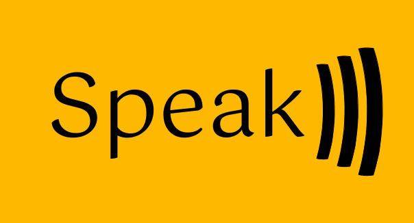

# Welcome

<h1 align="center">

</h1>

**Welcome to the Speak book!**

Speak is a machine-learning chatbot library, that you can use to create your own chatbot very easily, yet with a lot of power, and with a lot of flexibility.

This is the official Speak book, where you can find all the information you need to know about Speak, and how to use it, here you can find the explanation about the different components of Speak, and how to use them.

This book isn't meant for reading all in one go, but as a reference, as a more in-depth documentation, and as a way to get started with Speak.

If you want to install Speak as a dependency to your Rust project, jump to the next section with the arrow to the right going to *[**1.1** Instalación][install]*

<small>

**Protip:** You can use a *"Bionic Reading"* if you have problems reading (For dyslexia or other causes). This isn't sponsored, I just think this is very good.</small>

[install]: installation.md